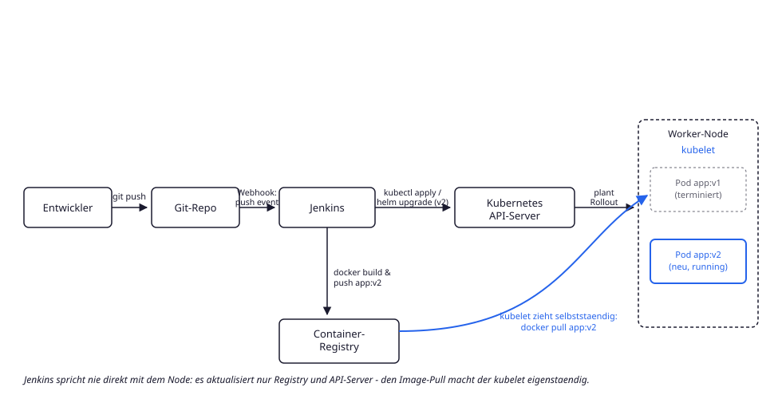

# Wie spielen Git, Jenkins und Kubernetes zusammen?

## Der Kernpunkt: Jenkins pusht das Image, aber nicht auf den Node

Der haeufigste Denkfehler: "Jenkins deployt die Anwendung auf die Kubernetes-Nodes."
Tatsaechlich hat Jenkins **nie eine Verbindung zu den Worker-Nodes** - es spricht nur
mit zwei Systemen:

1. **Container-Registry** - dorthin wird das frisch gebaute Image gepusht
   (`docker build && docker push app:v2`).
2. **Kubernetes-API-Server** - dort wird nur der *gewuenschte Zustand* aktualisiert
   (`kubectl apply` / `helm upgrade`, z. B. neuer Image-Tag in einem Deployment).

## Ablauf im Detail

1. Ein Entwickler pusht Code in das Git-Repo.
2. Ein Webhook (Push-Event) triggert einen Jenkins-Job.
3. Jenkins baut das Docker-Image und pusht es mit einem neuen Tag in die Registry.
4. Jenkins aktualisiert den gewuenschten Zustand im Kubernetes-Cluster
   (`kubectl apply -f deployment.yml` oder `helm upgrade` mit dem neuen Image-Tag).
5. Der Kubernetes-API-Server plant daraufhin ein Rollout auf einem passenden Node.
6. **Der `kubelet` auf diesem Node zieht das neue Image komplett eigenstaendig** aus
   der Registry (`docker pull app:v2`) - Jenkins ist an dieser Stelle nicht mehr
   beteiligt.
7. Der neue Pod (`app:v2`) startet, der alte Pod (`app:v1`) wird im Rahmen des
   Rolling-Updates terminiert.

## Warum das wichtig ist

* Erklaert, warum ein Jenkins-Agent **keinen Netzwerkzugriff auf die Worker-Nodes**
  braucht - nur auf Registry und Kubernetes-API.
* Erklaert, warum ein fehlgeschlagener `ImagePullBackOff` **nichts mit Jenkins** zu tun
  hat, sondern ein Problem zwischen `kubelet` und Registry ist (Credentials,
  Netzwerk, falscher Tag).
* Ist die Blaupause fuer GitOps-Ansaetze (z. B. Argo CD/Flux): dort ersetzt ein
  Controller im Cluster lediglich Schritt 4 - er zieht den gewuenschten Zustand selbst
  aus einem Git-Repo, statt dass Jenkins ihn per `kubectl apply` hineinschiebt.
