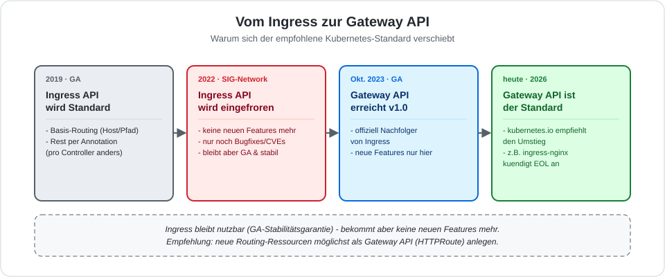
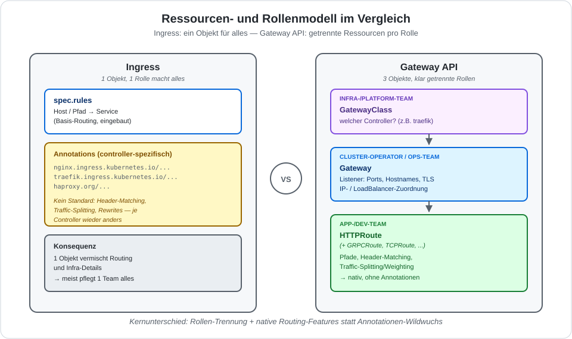

# Ingress vs. Gateway API

Die Kubernetes-Dokumentation empfiehlt inzwischen, für neues Routing die **Gateway API**
statt Ingress zu verwenden. Zwei Schaubilder dazu: erst der zeitliche Ablauf ("warum jetzt?"),
dann der inhaltliche Unterschied ("was ändert sich konkret?").

## 1. Ablauf: warum der Standard wechselt

Kernaussage aus der offiziellen Doku ([kubernetes.io/.../ingress](https://kubernetes.io/docs/concepts/services-networking/ingress/)):

> "The Kubernetes project recommends using Gateway instead of Ingress. The Ingress API has
> been frozen. The Ingress API is no longer being developed, and will have no further
> changes or updates made to it."

Gleichzeitig gilt aber auch:

> "The Ingress API is generally available [...] The Kubernetes project has no plans to
> remove Ingress from Kubernetes."

Sprich: Ingress verschwindet nicht, bekommt aber keine neuen Features mehr — alle
Weiterentwicklung findet in der Gateway API statt.

## 2. Ressourcen- und Rollenmodell im Vergleich

| | Ingress | Gateway API |
|---|---|---|
| Objekte | 1 (`Ingress`) | 3 (`GatewayClass`, `Gateway`, `HTTPRoute`/`GRPCRoute`/`TCPRoute`) |
| Rollen | meist 1 Team macht alles | Infra-Team, Ops-Team und App-Team jeweils eigene Ressource |
| Header-Matching, Traffic-Splitting | nur über controller-spezifische Annotationen | nativer Bestandteil der API |
| Portabilität zwischen Controllern | gering (Annotationen sind nicht standardisiert) | hoch (Kernfelder sind Standard) |

## Praxis in diesem Training

Die Ingress-Übungen mit Traefik ([Install](/ingress/traefik/install-with-helm.md),
[Beispiel](/kubectl-examples/04-ingress-traefik-with-hostnames-deployment.md)) bleiben
gültig — Ingress ist GA und in den allermeisten Clustern noch der Alltag. Die Gateway API
ist der Blick nach vorn: wer neue Projekte aufsetzt, sollte sie zumindest kennen.
