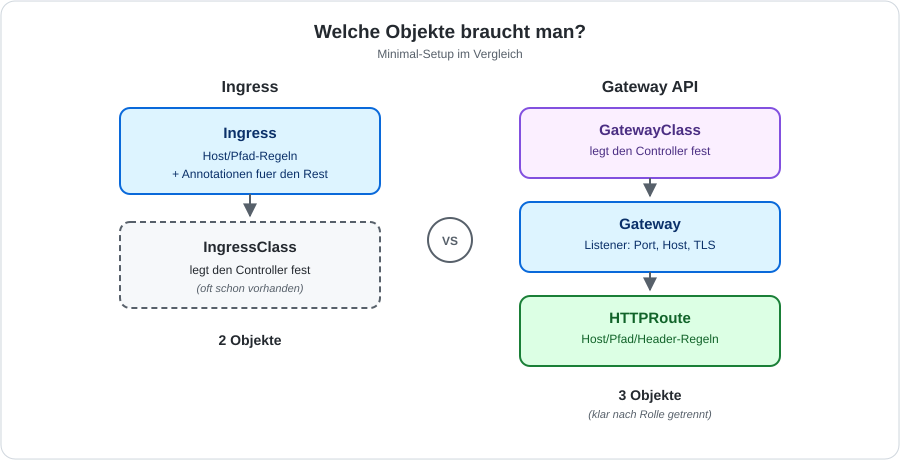

# Ingress vs. Gateway API

## Welche Objekte braucht man?

## Was kann Ingress, was kann die Gateway API?

| Feature | Ingress | Gateway API |
|---|---|---|
| Host-/Pfad-Routing | ✅ | ✅ |
| Header-/Query-Matching | ⚠️ nur per Annotation | ✅ nativ |
| Traffic-Splitting / Weighting | ⚠️ nur per Annotation | ✅ nativ |
| Redirects / URL-Rewrites | ⚠️ nur per Annotation | ✅ nativ |
| TLS-Terminierung | ✅ | ✅ |
| TCP/UDP/gRPC-Routing | ❌ | ✅ (`TCPRoute`, `GRPCRoute`) |
| Cross-Namespace-Routing | ❌ | ✅ (`ReferenceGrant`) |
| Portabilität zwischen Controllern | gering (Annotationen sind nicht standardisiert) | hoch (Kernfelder sind Standard) |
| Weiterentwicklung | [eingefroren](https://kubernetes.io/docs/concepts/services-networking/ingress/) | aktiv |

## Praxis in diesem Training

Die Ingress-Übungen mit Traefik ([Install](/ingress/traefik/install-with-helm.md),
[Beispiel](/kubectl-examples/04-ingress-traefik-with-hostnames-deployment.md)) bleiben
gültig — Ingress ist GA und in den meisten Clustern noch der Alltag. Die Gateway API
ist der Blick nach vorn.
